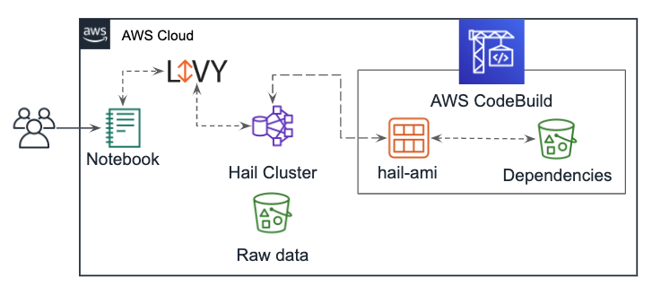
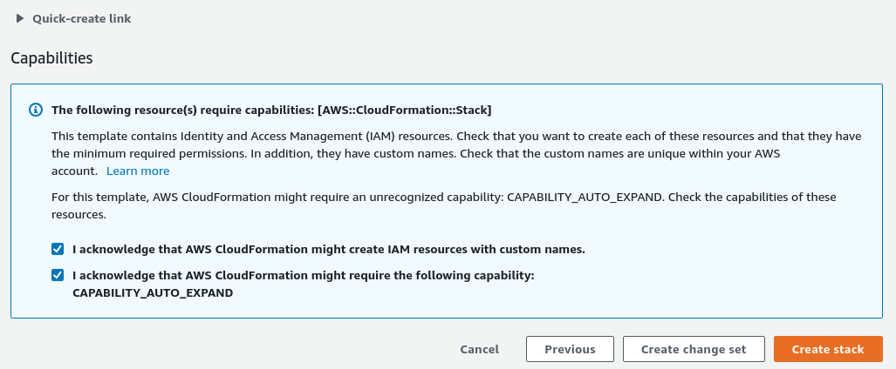
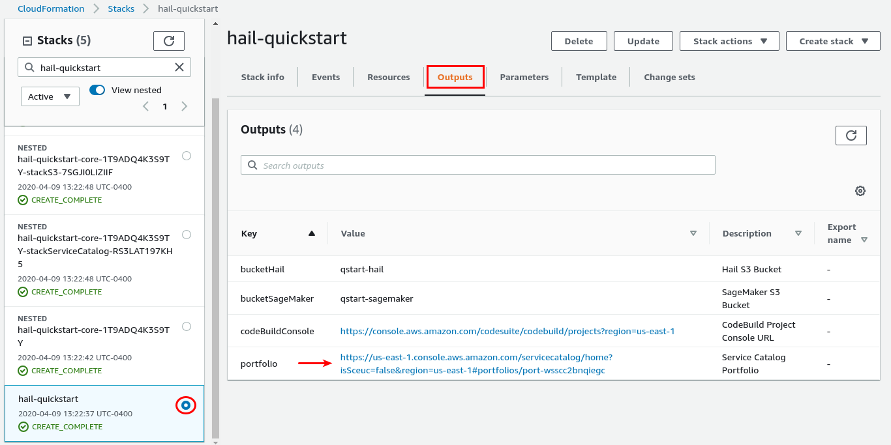
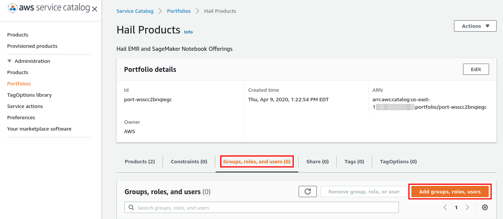
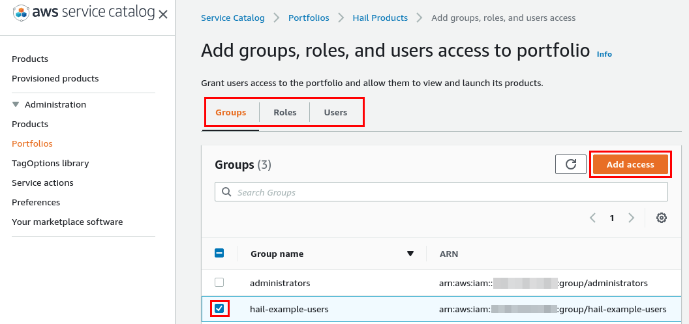
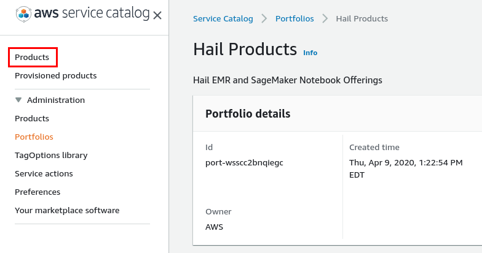
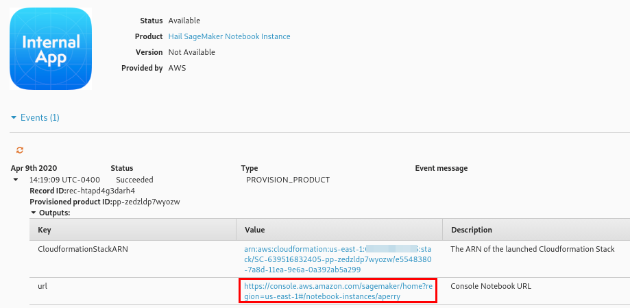
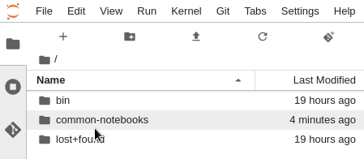

# Hail on EMR

This solution was designed to provide a reproducible, easy to deploy environment to integrate [Hail](https://hail.is) with [AWS EMR](https://aws.amazon.com/emr/faqs/?nc=sn&loc=7).  Where possible, AWS native tools have been used.

To integrate Hail and EMR, we leverage [Packer](https://www.packer.io/) from HashiCorp alongside [AWS CodeBuild](https://aws.amazon.com/codebuild/faqs/?nc=sn&loc=5) to create a custom AMI pre-packaged with Hail, and optionally containing the [Variant Effect Predictor (VEP)](https://uswest.ensembl.org/info/docs/tools/vep/index.html).  Then, an EMR cluster is launched using this custom AMI.

Users leverage an AWS SageMaker Notebook Instance to run JupyterLab, and pass commands to Hail from the notebook via [Apache Livy](https://livy.incubator.apache.org/).

This repository contains an AWS quickstart solution for rapid deployment into your AWS account. Certain parts of this repository assume a working knowledge of:  AWS, CloudFormation, S3, EMR, Hail, Jupyter, SageMaker, EC2, Packer, and shell scripting.

The core directories in this repository are:

- packer - Documentation and example configuration of Packer (used in the AMI build process)
- sagemaker - Sample Jupyter Notebooks and shell scripts
- submodules - Optional submodules supporting the deployment
- templates - CloudFormation nested stacks
- vep-configuration - VEP JSON configuration files

This document will walk through deployment steps, and highlight potential pitfalls.

## Table of Contents

- [Hail on EMR](#hail-on-emr)
  - [Table of Contents](#table-of-contents)
  - [Deployment Guide](#deployment-guide)
    - [hail-ami](#hail-ami)
    - [hail-emr](#hail-emr)
      - [Autoscaling Task Nodes](#autoscaling-task-nodes)
      - [SSM Access](#ssm-access)
  - [Public AMIs](#public-amis)
    - [Hail with VEP](#hail-with-vep)
    - [Hail Only](#hail-only)

## Deployment Guide

_Note:  This process will create S3 buckets, IAM resources, AMI build resources, a SageMaker notebook, and an EMR cluster.  These resources may not be covered by the AWS Free Tier, and may generate significant cost.  For up to date information, refer to the [AWS Pricing page](https://aws.amazon.com/pricing/)._

_You will require elevated IAM privileges in AWS, ideally AdministratorAccess, to complete this process._

To deploy Hail on EMR, follow these steps:

1. Log into your AWS account, and access the CloudFormation console.

2. Create a new stack using the following S3 URL as a template source - [https://privo-hail.s3.amazonaws.com/quickstart-hail/templates/hail-master.yml](https://privo-hail.s3.amazonaws.com/quickstart-hail/templates/hail-master.yml)

3. Set parameters based on your environment and select `Next`.

4. Optionally configure stack options and select `Next`.

5. Review your settings and acknowledge the stack capabilities.  Click `Create Stack`.

    

6. Once stack creation is complete select the root stack and open the `Outputs` tab.  Locate and click the Service Catalog Portfolio URL.

    

7. In the Service Catalog Portfolio requires assignment to specific Users, Groups, or Roles.  Select the `Users, Groups, or Roles` tab and click `Add groups, roles, users`.

    

8. Select the users, groups, and/or roles that will be allowed to deploy the Hail EMR cluster and SageMaker notebook instances.  When complete, click `Add Access`.

    

9. The selected users, groups, or roles can now click `Product Lists` in the Service Catalog console.

    

10. Launch a Hail EMR Cluster using one of the [Public Hail AMIs](#public-amis) to get started.

    

11. Launch a Hail SageMaker Notebook Instance.  Once the SageMaker Notebook Instance is provisioned open the Console Notebook URL.  This will bring you to the SageMaker console for your specific notebook instance.

    

12. Select `Open JupyterLab`.

    

13. Inside your notebook server, note that there is a `common-notebooks` directory.  This directory contains tutorial notebooks to get started interacting with your Hail EMR cluster.

    

## EMR Overview

The Service Catalog product for the Hail EMR cluster will deploy a single master node, a minimum of 1 core node, and optional autoscaling task nodes.

The [AWS Systems Manager Agent](https://docs.aws.amazon.com/systems-manager/latest/userguide/ssm-agent.html) (SSM) can be used to gain ingress to the EMR nodes.  This agent is pre-installed on the AMI.  To allow SageMaker notebook instance to connect to the Hail cluster nodes, set the following parameter to `true`.

Notebook service catalog deployments will also require a parameter adjustment to complete access.

### Autoscaling Task Nodes

Task nodes can be set to `0` to omit them.   The target market, `SPOT` or `ON_DEMAND`, is also set via parameters.  If `SPOT` is selected, the bid price is set to the current on demand price of the selected instance type.

The following scaling actions are set by default:

- +2 instances when YARNMemoryAvailablePercentage < 15 % over 5 min
- +2 instances when ContainerPendingRatio > .75 over 5 min
- -2 instances when YARNMemoryAvailablePercentage > 80 % over 15 min

## SageMaker Notebook Overview

The Service Catalog product for the SageMaker Notebook Instance deploys a single notebook instance in the same subnet as your EMR cluster.  Upon launch, several example notebooks are seeded into the `common-notebooks` folder.  These example notebooks offer an immediate orentation interacting with your Hail EMR Cluster.

### SSM Access

CloudFormation parameters exist on both the EMR Cluster and SageMaker notebook products to optionally allow notebook instances shell access via SSM.  Set the following parameter to `true` on when deploying your notebook product to allow SSM access.

Example connection from Jupyter Lab shell:

## Public AMIs

Public AMIs are available in specific regions. Select the AMI for your target region and deploy with the noted version of EMR for best results.

### Hail with VEP

| Region    | Hail Version | VEP Version | EMR Version | AMI ID                |
|:---------:|:------------:|:-----------:|:-----------:|:--------------------: |
| us-east-1 | 0.2.31       | 99          | 5.29.0      | ami-0f51d75d56c8469f7 |
| us-east-2 | 0.2.31       | 99          | 5.29.0      | ami-0ddba7b9f36e79d47 |
| us-west-2 | 0.2.31       | 99          | 5.29.0      | ami-0af36d6360120ea35 |

### Hail Only

| Region    | Hail Version | EMR Version | AMI ID                |
|:---------:|:------------:|:-----------:|:--------------------: |
| us-east-1 | 0.2.31       | 5.29.0      | ami-00fbbaf3c6ca73c57 |
| us-east-2 | 0.2.31       | 5.29.0      | ami-0daa264e629449221 |
| us-west-2 | 0.2.31       | 5.29.0      | ami-07fc30be8fe168cdb |
