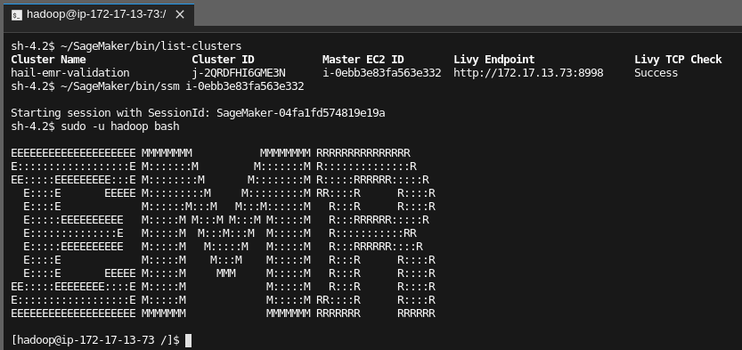

# Hail on EMR

This repository contains resources for repeatable deployments of [Hail](https://hail.is) on AWS EMR and an [AWS Sagemaker](https://aws.amazon.com/sagemaker/faqs) notebook instance configuration to interact with the Hail cluster.

## Table of Contents

- [Hail on EMR](#hail-on-emr)
  - [Table of Contents](#table-of-contents)
  - [CloudFormation Templates](#cloudformation-templates)
    - [hail-s3](#hail-s3)
    - [hail-jupyter](#hail-jupyter)
    - [hail-ami](#hail-ami)
    - [hail-emr](#hail-emr)
      - [Autoscaling Task Nodes](#autoscaling-task-nodes)
      - [Plotting](#plotting)
      - [SSM Access](#ssm-access)
  - [Deployment Order](#deployment-order)
  - [Public AMIs](#public-amis)
    - [Hail with VEP](#hail-with-vep)
    - [Hail Only](#hail-only)

## CloudFormation Templates

### hail-s3

This template is deployed once and creates 3 S3 buckets with SSE encryption.

- Hail Bucket - contains VEP cache and configuration JSON for Hail
- Log Bucket - EMR logs will be written here
- SageMaker Jupyter Bucket - Users notebooks will be backed up here, and common/example notebooks will be stored here as well.

### hail-jupyter

This template can be deployed multiple times (one per user).  It will deploy a SageMaker notebook instance for operations against the Hail EMR cluster.  The user's `/home/ec2-user/SageMaker` directory will be backed up via crontab to the SageMaker Jupyter bucket created in the `hail-s3` CloudFormation template.  The user's SageMaker notebook instance will have full S3 CLI control over their respective subdirectory.

For example, if a notebook instance is named `aperry` the user could open a terminal on that instance and have full AWS CLI control on objects under `s3://YOUR_JUPYTER_BUCKET/aperry/`.

When a new SageMaker instance launches it will sync in any scripts in the following directories located in the root of the bucket to the noted locations.

- common-notebooks => /home/ec2-user/SageMaker/common-notebooks
- scripts => /home/ec2-user/SageMaker/bin

You may wish to seed those directories in S3 with the identically named directories under `jupyter` in this repository.  Doing so will allow for a working Hail Plotting example.

CLI Example from repository root directory:

```bash
aws --profile <PROFILE> s3 sync jupyter/ s3://<YOUR_JUPYTER_BUCKET>/ --acl bucket-owner-full-control
```

Post upload, the bucket contents should look similar to this:

```bash
14:16 $ aws --profile <PROFILE> s3 ls --recursive s3://<YOUR_JUPYTER_BUCKET>/
2019-09-30 14:14:36      13025 common-notebooks/hail-plotting-example.ipynb
2019-09-30 14:14:36       1244 scripts/list-clusters
2019-09-30 14:14:36       1244 scripts/ssm
```

It is recommended that this template be deployed in the same subnet as your EMR cluster.

### hail-ami

This template leverages [Packer](https://www.packer.io/) in AWS CodeBuild to create AMIs for use with EMR.  You can specify a specific Hail Version, VEP version, and target VPC and subnet.

Review the [expanded documentation](packer/readme.md) for further details.

### hail-emr

This template deploys the EMR cluster using the custom Hail AMI.  There is a single master node, a minimum of 1 core node, and optional autoscaling task nodes.

#### Autoscaling Task Nodes

Task nodes can be set to `0` to omit them.   The target market, `SPOT` or `ON_DEMAND`, is also set via parameters.  If `SPOT` is selected, the bid price is set to the current on demand price of the selected instance type.

The following scaling actions are set by default:

- +2 instances when YARNMemoryAvailablePercentage < 15 % over 5 min
- +2 instances when ContainerPendingRatio > .75 over 5 min
- -2 instances when YARNMemoryAvailablePercentage > 80 % over 15 min

#### Plotting

EMR steps are used to add a location for Livy to output Hail plots directly to files on the master node.   Once written there those plots can be retrieved in the Sagemaker notebook instance and plotted inline.  See the [jupyter/common-notebooks/hail-plotting-example.ipynb](jupyter/common-notebooks/hail-plotting-example.ipynb) for an example.

The plotting pass through is required because the Sparkmagic/Livy can only pass spark and pandas dataframes back to the notebook.

#### SSM Access

The [AWS Systems Manager Agent](https://docs.aws.amazon.com/systems-manager/latest/userguide/ssm-agent.html) can be used to gain ingress to the EMR nodes.  This agent is pre-installed on the AMI.  CloudFormation parameters exist on both the EMR stack and the Jupyter stack to optionally allow notebook IAM roles shell access to the EMR nodes via SSM.  The respective stack parameters must both be set to `true` to allow proper IAM access.

Example connection from Jupyter Lab shell:



## Deployment Order

For expected results, deploy the templates in the following order.  Resources created by one stack may be used as parameter entries to later stacks.

1. hail-s3.yml
2. hail-jupyter.yml
3. hail-ami.yml
4. hail-emr.yml

## Public AMIs

Public AMIs are available in specific regions. Select the AMI for your target region and deploy with the noted version of EMR for best results.

### Hail with VEP

| Region    | Hail Version | VEP Version | EMR Version | AMI ID                |
|:---------:|:------------:|:-----------:|:-----------:|:--------------------: |
| us-east-1 | 0.2.31       | 99          | 5.29.0      | ami-0f51d75d56c8469f7 |
| us-east-2 | 0.2.31       | 99          | 5.29.0      | ami-0ddba7b9f36e79d47 |
| us-west-2 | 0.2.31       | 99          | 5.29.0      | ami-0af36d6360120ea35 |
| us-east-1 | 0.2.29       | 98          | 5.28.0      | ami-0b016dfca524fec33 |
| us-east-2 | 0.2.29       | 98          | 5.28.0      | ami-082b3c5dadecc4a87 |
| us-west-2 | 0.2.29       | 98          | 5.28.0      | ami-0aa2d49e3149759e9 |
| us-east-1 | 0.2.27       | 98          | 5.28.0      | ami-0eff76d452e943507 |
| us-east-2 | 0.2.27       | 98          | 5.28.0      | ami-074bd78cf15dce0a5 |
| us-west-2 | 0.2.27       | 98          | 5.28.0      | ami-010e68c2c559b37cf |
| us-east-1 | 0.2.25       | 98          | 5.27.0      | ami-0b16f8ef3418e707a |
| us-east-2 | 0.2.25       | 98          | 5.27.0      | ami-0fc5abc51396918fd |
| us-west-2 | 0.2.25       | 98          | 5.27.0      | ami-0feddab8068926b24 |

### Hail Only

| Region    | Hail Version | EMR Version | AMI ID                |
|:---------:|:------------:|:-----------:|:--------------------: |
| us-east-1 | 0.2.31       | 5.29.0      | ami-00fbbaf3c6ca73c57 |
| us-east-2 | 0.2.31       | 5.29.0      | ami-0daa264e629449221 |
| us-west-2 | 0.2.31       | 5.29.0      | ami-07fc30be8fe168cdb |
| us-east-1 | 0.2.29       | 5.28.0      | ami-05e440db5d3e3bcba |
| us-east-2 | 0.2.29       | 5.28.0      | ami-064ce48aad3e10749 |
| us-west-2 | 0.2.29       | 5.28.0      | ami-0d8c99d07ae2ebc5b |
| us-east-1 | 0.2.27       | 5.28.0      | ami-038d051a8baaf60ff |
| us-east-2 | 0.2.27       | 5.28.0      | ami-0b6d8fea9018ff7ac |
| us-west-2 | 0.2.27       | 5.28.0      | ami-096d1b6615904cbe0 |
| us-east-1 | 0.2.25       | 5.27.0      | ami-073f98d578b35345d |
| us-east-2 | 0.2.25       | 5.27.0      | ami-0c2ab8dbb74c44e36 |
| us-west-2 | 0.2.25       | 5.27.0      | ami-0842116d93dd08609 |
